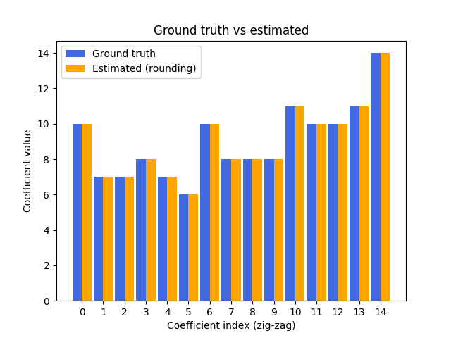

# Primary JPEG Quantization Estimation 

This program is free software: you can redistribute it and/or modify it under the terms of the GNU General Public
License as published by the Free Software Foundation, either version 3 of the License, or (at your option) any later
version. This program is distributed in the hope that it will be useful, but WITHOUT ANY WARRANTY; without even the
implied warranty of MERCHANTABILITY or FITNESS FOR A PARTICULAR PURPOSE.  See the GNU General Public License for
more details. You should have received a copy of the GNU General Public License along with this program.
If not, see <http://www.gnu.org/licenses/>.

If you are using this software, please cite:

Y.Niu, B. Tondi, Y.Zhao, M.Barni:
“Primary Quantization Matrix Estimation of Double Compressed JPEG Images via CNN",
IEEE Signal Processing Letters, 2019, November
Available on ArXiv: [arXiv preprint:1908.04259](https://arxiv.org/abs/1908.04259)
    
The software estimates the primary quantization matrix of a Double JPEG image (either aligned and not aligned) 
based on a Convolutional Neural Network. The CNN-based estimator works with a 64x64 input patch size. 
The first 15 coefficients of the primary quantization matrix, in zig zag order, are returned by the software.

A model is trained for a fixed quality of the second JPEG compression QF2.

<br>

## Installing dependencies

To install the packages required by our software, you may use the provided *requirements.txt*:
```
cd CnnJpegPrimaryQuantizationEstimation
python3 -m venv myvenv
source myvenv/bin/activate
pip install -r resources/requirements.txt
```
We tested our codes on Python 3.5 and Python 3.6 under Ubuntu 16.04 and 18.04 (64 bit).

<br>

## Preparing datasets

We used a copy of the [RAISE8K dataset](http://loki.disi.unitn.it/RAISE/), which was preliminarily 
(and randomly) split into two sub-folders:
* **Train**: 7000 TIF images
* **Test**: 1157 TIF images

The lists of images composing each sub-set can be found in the *./resources* folder: files are named 
respectively *r8k_train.txt* and *r8k_test.txt*. To split your own copy of the RAISE8K dataset, you can use 
the following script:

```
cd CnnJpegPrimaryQuantizationEstimation
python3 -m venv myvenv
source myvenv/bin/activate
python3 Split_RAISE8K.py -rdir "/path/to/full/raise8k" -o "output/path/to/split/raise8k" -res "./resources" -copy 1
```

where: *-rdir* is the path to the RAISE8K directory; *-o* is the path to the directory where RAISE8K is split
into two subfolders (Train, Test); *-res* is the directory where .txt lists are stored; *-copy* either
duplicates (1) or moves (0) files


#### Dataset configuration

The creation of the datasets of image patches is controlled by the parameters listed in *configuration.py* 
(also reported in this document); default values in the file coincide with those we used in our paper's 
implementation.

The script *dataset.py* creates a training and test dataset of double JPEG compressed image patches 
for a given set of JPEG quality factor pairs (QF1, QF2). The first JPEG compression's quality factor 
varies in a given range (e.g. QF1 = [60, 70, 80, 90]) while the second JPEG compression's quality factor is 
fixed (e.g. QF2 = 90). The code also creates two CSV files that contain information about all patches 
for all (QF1, QF2) pairs; such information, specifically the path to the image files and their training labels 
(i.e. the JPEG quantization matrix flattened array in zig-zag order), is used to drive the training and 
test phases.

Some settings in *configuration.py* are self-explaining. The most important settings are the following:

Set the patch size and the number of patches that are (randomly) picked from each input image. The fixed number
of blocks for each image avoids to create a biased dataset from too few images:
```
block_size = (64, 64)          # Image size for the whole training / testing process
max_blocks_img = 100           # Number of blocks that are created for each image
```
Set input folders where the original RAISE 8K dataset has been split with the *Split_RAISE8K.py* utility:
```
input_train_dir = '/Datasets/RAISE8Ksplit/Train'
input_test_dir = '/Datasets/RAISE8Ksplit/Test'
```
Set output folders where the training and test patches and their CSV companions are created, one folder
for each (QF1, QF2) pair, one CSV for joining them all:
```
out_train_dir = '/Datasets/DeepQuantiFinder/Train'
out_test_dir = '/Datasets/DeepQuantiFinder/Test'
```
Set the name of the CSV files used to drive the training and test phases:
```
training_csv = 'train.csv'
test_csv = 'test.csv'
```
Set the (QF1, QF2) pairs and the number of training and test images for each QF pair:
```
q_factors = [(60, 90), (65, 90), (70, 90), (75, 90), (80, 90), (85, 90), (90, 90), (95, 90), (98, 90)]
n_blocks_train = [4e5, 4e5, 4e5, 4e5, 4e5, 4e5, 4e5, 4e5, 4e5]
n_blocks_test = [4e4, 4e4, 4e4, 4e4, 4e4, 4e4, 4e4, 4e4, 4e4]
```

#### Model training and testing

To train a model, run the *train.py* script. Model training is controlled by the parameters listed 
in *configuration.py*; default values in the file coincide with those we used in our paper's implementation.
```
base_lr = 1e-5                         # Learning rate
max_no_Q_coefs = 15                    # Number of quantization coefficients used for training
batch_size = 32                        # Training batch size
n_epochs = 40                          # Training epochs
scaling_factor_data = 255.0            # Input images (values [0, 255]) are scaled to [0, 1]
snapshot_frequency = 1000              # Frequency (iterations for saving training metrics)
```
In *train.py* is possible to use other networks. We used DenseNet, whose implementation in this Git is 
the one by Christopher Masch [available on GitHub](https://github.com/cmasch/densenet/blob/master/densenet.py).      

To test the model you can use *predict.py*. Make sure to adapt the script to point to the right 
to-be-tested model file:  
```
model_file = '/path/to/the/model/the_model.h5'
``` 
The script computes some metrics including average Mean Square Error (MSE), average Normalised MSE and average 
accuracy from CNN's estimated coefficients and ground truth for each pair (QF1, QF2). The script also generates
a CSV file with all the details of the test for each image of the dataset.

#### Demo: estimation of QF1
The script *Demo.py* implements a simple demonstration of quantization coefficients estimation for a patch
with (QF1, QF2) = (70, 90) with a our pretrained model in ./resources/pre_trained/.



#### Reproducibility
The choice of image patches when datasets are created is random for each image. Even though the choice of blocks
should not affect the outcome of the training, for sake of reproducibility, we include the list on input images
that we used for training and test in our paper. The lists can be found in ./resources/reproducibility/ and are
called *train_images.txt* and *test_images.txt*.
